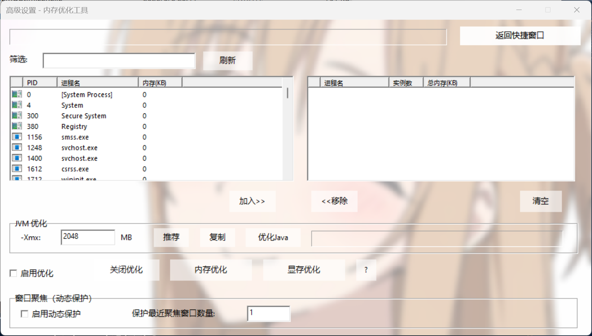

# Memory & GPU Optimizer

[](LICENSE)
[](https://www.microsoft.com/windows)
[](https://visualstudio.microsoft.com/)

**Memory & GPU Optimizer** 是一款专为 Windows 平台设计的轻量级内存与显存优化工具。它能够一键释放系统工作集、清理待机列表（Standby List），并针对 Java 应用进行内存整理，同时支持进程白名单和动态窗口聚焦保护，有效提升游戏、视频剪辑等重负载场景下的系统响应能力。

---

## 📁 项目结构树

``````
MemOptimizer/
├── MemOptimizer.sln # Visual Studio 解决方案
├── MemOptimizer.vcxproj # 项目文件
├── MemOptimizer.cpp # 主程序源代码
├── MemOptimizer.h # 头文件
├── Resource.h # 资源 ID 定义
├── MemOptimizer.rc # 资源脚本（对话框、图标、背景图等）
├── targetver.h # 平台版本定义
├── framework.h # 框架头文件
├── app.ico # 主程序图标
├── small.ico # 小图标
├── MemOptimizer.ico # 备用图标
├── Background_1.bmp # 简约窗口背景图（24位 BMP）
├── Background_2.bmp # 高级窗口背景图（24位 BMP）
├── EmptyStandbyList.exe # 内嵌的待机列表清理工具（资源）
├── README/ # 文档目录
│ ├── README.md # 本说明文件
│ ├── LICENSE.md # 许可证文件
│ └── image/ # 截图
│ ├── contextMenu.png # 简约窗口截图
│ └── advancedMenu.png # 高级窗口截图
├── x64/Release/ # 编译输出目录
│ ├── MemOptimizer.exe # 可执行程序
│ └── MemOptimizer.pdb # 调试符号
└── ...（其他编译中间文件已省略）
``````

*注：仅为展示核心文件，编译生成的临时文件未列出。*

---

## 📖 项目介绍声明

### ✨ 核心特性

- **一键优化**：提供“内存优化”、“显存优化”、“JVM优化”和“一键三连”按钮，快速释放物理内存和显存缓存。
- **双窗口界面**：简约主窗口 + 高级设置窗口，兼顾易用性和可配置性。
- **动态窗口聚焦**：自动保护当前活跃窗口的进程（可设置保留数量），避免被内存清理误伤。
- **进程白名单**：手动添加/移除受保护进程，支持显示实例数和总内存占用。
- **智能排序**：点击列表列头即可按 PID、进程名或内存大小排序（升序/降序）。
- **JVM 参数助手**：一键推荐 -Xmx 值、复制完整 JVM 参数（`-Xmx`、`-Xms`、`+UseG1GC` 等），并支持对 Java 进程单独优化。
- **自定义背景**：可嵌入 24 位 BMP 图片作为窗口背景，控件半透明（按钮 60% 白色半透），美观且不刺眼。
- **配置本地存储**：所有设置保存在 `%LocalAppData%\MemoryOptimizer\Optimizer.ini`，无云端上传。
- **内嵌清理工具**：已集成 `EmptyStandbyList.exe`（[wj32](https://wj32.org/wp/software/empty-standby-list/)），运行时自动释放并调用，无需额外下载。

### 🛡️ 安全与兼容

- 不修改注册表，不删除用户文件，仅调用 `EmptyWorkingSet` 和 `NtSetSystemInformation`（需管理员权限）。
- 兼容 Windows 7 / 8 / 10 / 11（x64），推荐使用 Windows 10/11 并以管理员身份运行。
- 使用 GDI+ 实现透明/半透绘制，无第三方 DLL 依赖。

### 📜 许可

本程序采用 **CC BY-NC 4.0 许可证**（知识共享-署名-非商业性使用 4.0 国际）。
您可自由分享、修改本软件，但**不得用于商业目的**，且必须保留版权声明。详情见 [LICENSE](LICENSE) 文件。

---

## 🚀 项目使用说明

### 系统要求

- 操作系统：Windows 7 SP1 或更高版本（x64）
- 运行库：Visual C++ 运行时（一般系统自带，如缺少可安装 [VC++ Redistributable](https://aka.ms/vs/17/release/vc_redist.x64.exe)）
- 权限：建议以管理员身份运行（右键 → “以管理员身份运行”）

### 下载与编译

您可以直接下载 [Releases](https://github.com/yourname/MemoryOptimizer/releases) 中的预编译 `Memory Optimizer.exe`，或自行编译：

1. **使用 Visual Studio 2022** 打开 `MemOptimizer.sln`。
2. 设置解决方案平台为 `x64`。
3. 右键项目 → **属性** → **链接器** → **清单文件** → **UAC 执行级别** → 选择 `requireAdministrator (/level='requireAdministrator')`。
4. 生成解决方案（F7）。

编译后会在 `x64\Release\` 目录生成 `MemOptimizer.exe`。若需自定义背景图片，将 `Background_1.bmp` 和 `Background_2.bmp`（24 位位图）放入 exe 同级目录即可。

### 操作指南

#### 1. 简约主窗口

 

- **JVM优化**：清理所有 Java 进程的工作集。
- **内存优化**：释放所有非白名单进程的物理内存（工作集）。
- **显存优化**：先清理工作集，再调用 `EmptyStandbyList` 清空待机列表（包括显存缓存）。
- **一键三连**：依次执行上述三项优化。
- **关闭优化**：清空白名单、重置 JVM 参数、关闭总开关和窗口聚焦。
- **启用优化**：总开关，关闭后点击任何优化按钮均无效果。
- **窗口聚焦**：开启后自动保护当前活动窗口的进程（保护数量在高级窗口中设置）。
- **高级设置**：进入详细配置界面。

#### 2. 高级设置窗口



- **进程白名单**：
  - 左侧为系统所有进程（可筛选、双击加入）。
  - 右侧为永久白名单（双击移除）。
  - 支持列排序。
- **JVM 优化**：手动设置 `-Xmx` 值，一键推荐或复制参数。
- **窗口聚焦**：设置动态保护开关及保护进程数量。
- **返回简约窗口**：关闭高级窗口并重新显示主窗口。

### 配置文件与数据

- **位置**：`%LocalAppData%\MemoryOptimizer\Optimizer.ini`
- **内容**：白名单列表、JVM Xmx 值、窗口聚焦开关及数量、总开关状态。
- **重置**：删除该文件或点击“关闭优化”按钮即可重置所有设置。

### 常见问题

| 问题                 | 解决方法                                                     |
| -------------------- | ------------------------------------------------------------ |
| **显存优化提示失败** | 未以管理员身份运行。请右键程序选择“以管理员身份运行”，或在属性中设置始终以管理员运行。 |
| **列表图标不显示**   | 确保程序以管理员权限运行（某些系统权限导致无法读取进程图标）。 |
| **背景图片不显示**   | 将图片转换为 24 位 BMP 格式，并放入与 exe 同目录；或使用嵌入资源方式（重新编译）。 |
| **编译错误 GDI+**    | 确保项目已链接 `gdiplus.lib`，且包含头文件 `<gdiplus.h>`。   |

---

## ⚠️ 免责声明

本软件为免费开源工具，仅供个人学习与研究使用。作者不对因使用本软件导致的任何直接或间接损失承担责任。

- 使用前请备份重要数据，清理内存可能导致未保存的文档丢失（建议先保存工作）。
- 本软件不联网、不收集任何用户信息。
- 若以管理员身份运行，软件会调用系统底层 API，但不会修改系统关键配置。
- 如您不同意以上声明，请立即停止使用并删除本软件。

---

## 🙏 沿用项目说明 & 鸣谢

本工具在开发过程中参考或使用了以下开源项目/技术：

- **[EmptyStandbyList](https://github.com/wj32/EmptyStandbyList)** by **wj32** – 用于清理系统待机列表的独立命令行工具，已内嵌至资源，并遵守其原始许可证（GPLv2）。
- **[GDI+](https://docs.microsoft.com/en-us/windows/win32/gdiplus/-gdiplus-gdi-start)** – 微软图形设备接口，用于实现按钮和列表的半透明渲染。
- **Windows API** – 包括 `Psapi.h`、`TlHelp32.h`、`CommCtrl.h`、`ShellAPI.h` 等。
- **Visual Studio 2022** – 开发和调试环境。

### 鸣谢

- 感谢所有测试并提供反馈的朋友。
- 特别感谢 **wj32** 提供的 `EmptyStandbyList.exe` 工具，使显存优化稳定可靠。
- 本项目的设计灵感来源于作者：龙腾猫跃 开发的PCL2启动器中的内存优化功能，以及低配置用户、游戏玩家对“内存清理器”的通用需求，力求轻量、透明、易用。

### 沿用说明

如果您计划在本项目基础上进行二次开发或整合，请注意：

- 保持 `EmptyStandbyList.exe` 的版权声明和许可证完整性（已内嵌）。
- 若修改背景图片或资源，请勿侵犯第三方图片版权。
- 任何分发版本应保留原始作者信息（`开发者：Heszer`）。

### 联系作者

- 开发者：Heszer
- 邮箱：`h3532886804@163.com`
- GitHub Issues：欢迎提交 bug 或功能建议。

---

***感谢您使用 Memory & GPU Optimizer！愿您的电脑时刻流畅如新。***

***我希望您永远用不上我的程序，我也希望我永远用不上它，但在您需要的时候，它永远在这里等您。***

*I hope you never have to use my program, and I also hope I never have to use it, but when you need it, it will always be here waiting for you.*